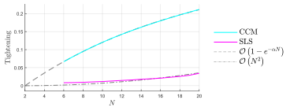

# A Comparison on Robust MPC Methods for Nonlinear Systems

## Description

This repository contains the MATLAB code that accompanies the semester project:
> Erdin, Alexander “A Comparison on Robust MPC Methods for Nonlinear Systems”
> 2024.



### References

- The CCM class is a generalized version of the [code](https://gitlab.ethz.ch/ics/RAMPC-CCM.git) accompaning the paper
  > Sasfi, András and Zeilinger, Melanie N. and Köhler, Johannes, "[Robust adaptive MPC using control contraction metrics](http://dx.doi.org/10.1016/j.automatica.2023.111169)"
  > Automatica, p. 111169, 2023.
- The SLS class is an adapted version of the [code](https://gitlab.ethz.ch/ics/nonlinear-parametric-SLS.git) accompaning the paper
  > Leeman, Antoine P. and Sieber, Jerome and Bennani, Samir and Zeilinger, Melanie N. “[Robust optimal control for nonlinear systems with parametric uncertainties via system level synthesis](https://arxiv.org/abs/2304.00752)”
  > In Proc. 62th IEEE Conference on Decision and Control (CDC), pp. 4784-4791, 2023.

## Prerequisites

- MATLAB (tested with version R2023a)
- Casadi
- YALMIP (for offline computations)
- Mosek  (for offline computations)

## Installation

### Software

To run this project you need to install the following software.

1. Download and install [MATLAB](https://www.mathworks.com/products/matlab.html)

2. Install Casadi by following the instructions from the official [Casadi](https://web.casadi.org/get/) documentation

3. Install YALMIP by downloading the most recent version [here](https://yalmip.github.io/tutorial/installation/)

4. Install [MOSEK](https://docs.mosek.com/latest/install/installation.html) following the instructions on their web page

5. Clone this repository or download the code as a ZIP archive and extract it to a folder of your choice

6. Add the code folder to your MATLAB path by running `initWorkspace.m`

## Usage

Run `main.m` to execute the algorithms and models discussed in this semester project.

## License

This project is licensed under the MIT License.

## Citation

If you use this code in your research, please cite our paper:

```text
@article{erdin2024RMPC,
  title={A Comparison on Robust MPC Methods for Nonlinear Systems},
  author={Erdin, Alexander},
  year={2024}
}
```
  
## Support and Contact

For any questions or issues related to this code, please contact the author:

- Alexander Erdin: aerdin(at)ethz(dot)ch

We appreciate any feedback, bug reports, or suggestions for improvements.
